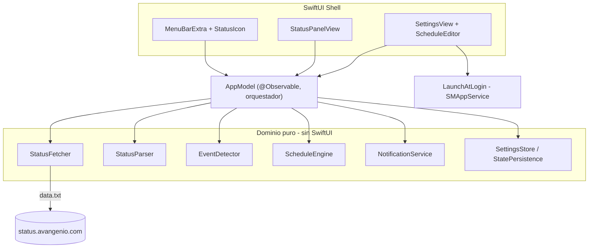
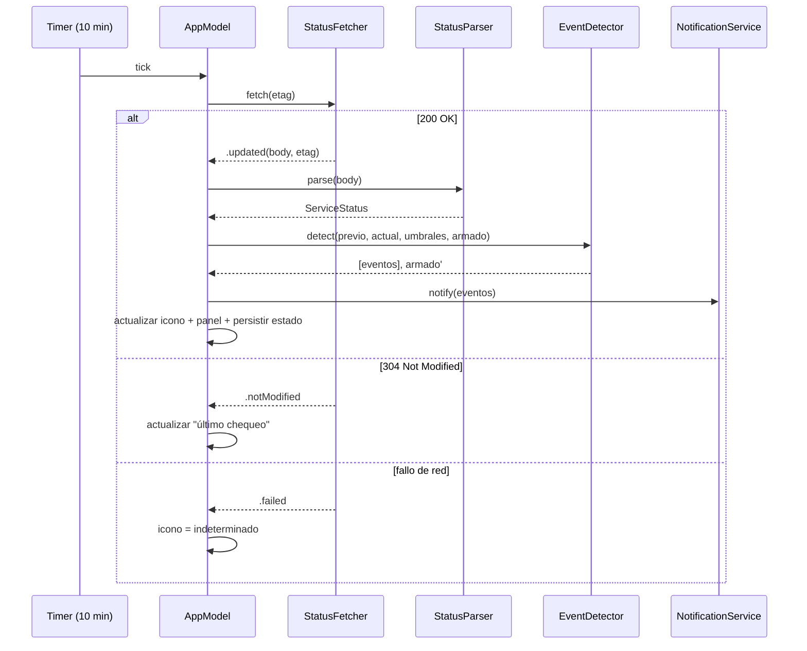

# Avangenio Status Menu Bar App - Plan

**Product Contract preservation:** cambios menores clarificadores (no de alcance) aplicados en
la revisión de documento del 2026-08-07: R4 (forma+color del icono), R5 (4 métricas de estado +
hora), R9 (alcance del toggle de avisos), R12 (recuperación del permiso). Ningún requisito
nuevo ni cambio de intención de producto. OQ1 (umbrales) y OQ2 (estructura) resueltas en
planificación — ver KTD3 y KTD1.

---

## Goal Capsule

**Objetivo:** Construir una app nativa de barra de menú para macOS que monitorea el
estado de los servicios de Avangenio leyendo `https://status.avangenio.com/data.txt`,
avisando por notificaciones locales tanto ante cambios de estado (eventos) como en
horarios configurables por el usuario (reportes programados).

**Autoridad de producto:** el usuario (uso personal / interno).

**Blockers abiertos:** ninguno.

---

## Summary

App de barra de menú SwiftUI (`MenuBarExtra`, macOS 14+, sin icono en Dock) que hace
polling cada 10 min al endpoint de texto plano de Avangenio con GET condicional, parsea
las 4 métricas de estado, y notifica por eventos (transiciones con histéresis) y por schedules
definidos por el usuario. Sin dependencias externas: `URLSession`, `UserNotifications`,
`ServiceManagement`. La lógica de dominio (fetch, parse, detección de eventos, scheduler)
está aislada del shell SwiftUI para permitir tests unitarios y una eventual migración a un
shell híbrido AppKit.

---

## Product Contract

### Problema

El usuario necesita enterarse a tiempo del estado de la infraestructura de Avangenio
(internet, ancho de banda, baterías de respaldo, servicio eléctrico estatal) sin tener
que abrir manualmente la página de status. Los cambios críticos —como la pérdida del
servicio eléctrico o la caída de internet— deben notificarse cuando ocurren, y además
el usuario quiere resúmenes en horarios que él mismo define.

### Usuarios

Usuario único / personal (y potencialmente colegas que compilen la app por su cuenta).
Corre en su Mac con macOS 14 (Sonoma) o superior. Sin autenticación ni multi-usuario.

### Fuente de datos

`https://status.avangenio.com/data.txt` — `text/plain`, UTF-8, 5 líneas. Ejemplo real:

```
Ultima actualizacion: Fri Aug  7 12:19:01 CDT 2026
Internet Status: OK
Ancho de Banda por Usuario: 4.42 Mbps
Estado de las baterías: 26.00%
Servicio Eléctrico Estatal: NO
```

Campos parseados:

| Línea | Campo | Tipo | Valores observados |
|---|---|---|---|
| 1 | Última actualización | fecha/hora (zona CDT) | `Fri Aug  7 12:19:01 CDT 2026` |
| 2 | Internet Status | enum | `OK` / (caído) |
| 3 | Ancho de banda por usuario | número + `Mbps` | `4.42 Mbps` |
| 4 | Estado de las baterías | porcentaje | `26.00%` |
| 5 | Servicio Eléctrico Estatal | booleano | `YES` / `NO` |

La respuesta HTTP incluye `Last-Modified` y `ETag`, aptos para GET condicional.
El API se actualiza aproximadamente cada minuto.

### Requisitos

**R1 — Forma de la app.** App de barra de menú (SwiftUI `MenuBarExtra`), sin icono en
el Dock (`LSUIElement`). Corre en segundo plano de forma continua.

**R2 — Polling.** Consultar el API cada 10 minutos usando GET condicional
(`If-None-Match` con el `ETag`, o `If-Modified-Since`). Si el servidor responde `304`,
no reprocesar. Intervalo configurable en ajustes (default 10 min).

**R3 — Parseo.** Convertir las 5 líneas de texto a un modelo tipado. Tolerar variaciones
menores de espaciado. Si el formato no parsea, tratarlo como estado inválido (no crashear).

**R4 — Icono de estado.** El icono de la barra refleja la salud de un vistazo, distinguiendo
cada estado por **forma (SF Symbol) además de color** — para no depender solo del color
(daltonismo) ni perderlo si la barra renderiza el icono como *template* monocromo:
- Normal (todo OK) → verde, símbolo de check/círculo lleno.
- Alerta (electricidad `NO` o internet caído) → rojo, triángulo de exclamación.
- Sin conexión al API (fetch fallido) → gris/indeterminado, símbolo con badge de interrogación.

**R5 — Panel al hacer clic.** Muestra las 4 métricas de estado (internet, ancho de banda,
baterías, electricidad) + la hora de última actualización reportada por el API. Acceso a
ajustes y opción de refrescar ahora.

**R6 — Notificaciones por evento (transición).** Emitir una notificación local cuando,
comparado con el estado previo, ocurre una transición:
- **Electricidad** cambia `NO`↔`YES`.
- **Internet** cae (`OK`→caído) o se recupera (caído→`OK`).
- **Baterías** cruzan *a la baja* un umbral configurable.
- **Ancho de banda** cruza *a la baja* un umbral configurable.

Las notificaciones se emiten en la transición, **no** repetidamente en cada poll.

**R7 — Re-arme de umbrales.** Tras avisar por cruce a la baja (baterías o banda), no
volver a avisar hasta que la métrica regrese por encima del umbral (histéresis simple).

**R8 — Reportes programados.** El usuario puede definir uno o más schedules que emiten
una notificación-resumen del estado. Cada schedule especifica:
- Días de la semana (ej. L–V).
- Hora fija (ej. 9:00) **o** rango horario con intervalo (ej. 8:00–18:00 cada 2h).

Al dispararse un schedule, la app hace un fetch fresco y notifica el resumen de las 5
métricas, independientemente de si hubo cambios.

**R9 — Ajustes.** Interfaz para: umbrales (baterías, ancho de banda), intervalo de
polling, gestión (crear/editar/borrar) de schedules, y toggles de avisos. El toggle
general de avisos **silencia tanto los eventos como los reportes programados**; además,
cada schedule puede activarse/desactivarse individualmente sin borrarlo. La UI también
muestra el estado del permiso de notificaciones (ver R12).

**R10 — Arranque al iniciar sesión.** Opción (toggle) para lanzar la app al iniciar
sesión, vía `SMAppService`. Desactivado por defecto.

**R11 — Persistencia de configuración y último estado.** Guardar ajustes, schedules y el
último estado conocido (para detectar transiciones y umbrales tras reinicios de la app).

**R12 — Permiso de notificaciones.** Solicitar autorización de notificaciones al usuario
la primera vez; degradar con gracia si se deniega (la app sigue mostrando el panel). Como
macOS no vuelve a preguntar tras una denegación, Ajustes debe **mostrar el estado del
permiso** y, si no está concedido, ofrecer un botón que abra Ajustes del sistema >
Notificaciones para reactivarlo (evita que el usuario confíe en avisos que nunca llegarán).

### Flujos

**F1 — Ciclo de polling.**
Timer dispara → `StatusFetcher` hace GET condicional → si `200`, `StatusParser` produce
modelo → `EventDetector` compara contra último estado persistido → si hay transiciones
relevantes, `NotificationService` emite avisos → se actualiza icono, panel y último estado.
Si `304`, solo se actualiza la marca de "revisado". Si el fetch falla, icono pasa a
indeterminado.

**F2 — Reporte programado.**
Llega la hora de un schedule → fetch fresco → `NotificationService` emite notificación-
resumen con las 4 métricas de estado → se actualiza el estado como en F1.

**F3 — Primer arranque.**
App inicia → pide permiso de notificaciones → primer fetch → puebla panel e icono → no
emite eventos (no hay estado previo con qué comparar; solo se establece la línea base).

### Acceptance Examples

**AE1 (evento de electricidad):** Estado previo `Electricidad: YES`. Nuevo poll devuelve
`Servicio Eléctrico Estatal: NO`. → Se emite **una** notificación "Servicio eléctrico
estatal: caído". El siguiente poll que siga en `NO` **no** vuelve a notificar.

**AE2 (umbral con re-arme):** Umbral de baterías = 30%. Baterías pasan de 32% a 28%. →
Notificación "Baterías por debajo del 30% (28%)". Siguiente poll en 27% → sin
notificación. Baterías suben a 35% → se re-arma. Luego bajan a 29% → notifica de nuevo.

**AE3 (reporte programado):** Schedule "L–V de 8:00 a 18:00 cada 2h". Un martes a las
14:00 → fetch fresco + notificación-resumen con las 4 métricas de estado, aunque nada haya cambiado.

**AE4 (sin conexión):** El internet del usuario está caído y el fetch a
`status.avangenio.com` falla por timeout. → Icono pasa a gris/indeterminado; **no** se
emite "Internet caído" (eso solo se emite si el API lo reporta explícitamente).

**AE5 (GET condicional):** El API no ha cambiado desde el último poll. Respuesta `304`. →
La app no reprocesa ni emite nada; solo actualiza la hora del último chequeo.

### Key Decisions (producto)

- **KD1:** Shell en SwiftUI `MenuBarExtra`, macOS 14+. Lógica de dominio aislada del shell.
- **KD2:** Sin dependencias externas: `URLSession`, `UserNotifications`, `ServiceManagement`.
- **KD3:** Notificaciones por transición con histéresis, no por estado sostenido.
- **KD4:** Distinguir "fallo de conexión" (estado desconocido) de "API reporta caído".
- **KD5:** Distribución uso personal / firma ad-hoc; sin notarización ni App Store en v1.
- **KD6:** Schedules basados en hora local del Mac.

### Out of Scope (v1)

- Historial persistente de cambios y gráficas de tendencia.
- Distribución firmada con Developer ID / notarización.
- Publicación en Mac App Store.
- Versión iOS / iPadOS.
- Monitoreo de múltiples servidores o endpoints.
- Sincronización de ajustes entre máquinas.

### Outstanding Questions

- **OQ1 — RESUELTA.** Umbrales por defecto: **baterías 30%**, **ancho de banda 1 Mbps**
  (ver KTD3). Configurables en ajustes.
- **OQ2 — RESUELTA.** Estructura: **proyecto Xcode** (ver KTD1).
- **OQ3 (diferida a implementación):** detalle visual del editor de schedules — se resuelve
  al construir la UI (U9).
- **OQ4 (diferida a implementación):** copy e íconos exactos de cada notificación — se
  ajustan al construir `NotificationService` (U6).

---

## Planning Contract

### Key Technical Decisions

**KTD1 — Proyecto Xcode (`.xcodeproj`), macOS 14+.** *(session-settled: user-directed —
elegido sobre Swift Package: la app necesita `Info.plist` con `LSUIElement`, entitlements
de notificaciones y un target `.app`, que Xcode gestiona de forma nativa.)* Governs R1, R10.
Un solo app target + un test target XCTest. Deployment target macOS 14.0. Firma automática
"Sign to Run Locally" (ad-hoc), sin cuenta de desarrollador de pago.

**KTD2 — Capas de dominio puras, aisladas del shell.** El dominio (`StatusParser`,
`StatusFetcher`, `EventDetector`, `ScheduleEngine`, `NotificationService`, `SettingsStore`)
no importa SwiftUI y no toca estado global; recibe dependencias por inyección. Un objeto observable
(`AppModel`, `@Observable`) orquesta y expone estado a las vistas. Esto habilita tests
unitarios sin UI y una eventual migración del shell.

**KTD3 — Umbrales por defecto: baterías 30%, ancho de banda 1 Mbps.** *(session-settled:
user-directed.)* Governs R6, R7. Persistidos en `UserDefaults`, editables en ajustes.

**KTD4 — Detección de eventos con histéresis por métrica.** El `EventDetector` es una
función pura `(previo, actual, umbrales, flags de armado) -> (eventos, nuevos flags)`. Para
cada métrica de umbral mantiene un flag "armado": dispara al cruzar a la baja, se desarma
hasta que la métrica vuelva a superar el umbral. Governs R6, R7. Satisface AE1, AE2.

**KTD5 — GET condicional con `ETag`/`Last-Modified` guardados en `UserDefaults`.** El
`StatusFetcher` envía `If-None-Match` (y `If-Modified-Since` como respaldo). Respuesta `304`
→ resultado `.notModified` sin body. Fallo de red → `.failed(error)`, distinto de "API
reporta caído". La `URLSession` inyectada se configura **sin caché** (`urlCache = nil`,
`requestCachePolicy = .reloadIgnoringLocalCacheData`) para que el `304` gestionado a mano
llegue crudo al llamador en vez de que `URLCache` lo convierta en un `200` servido de caché.
Governs R2. Satisface AE4, AE5.

**KTD6 — Scheduler en proceso con `Timer`, no `UNCalendarNotificationTrigger`.** Como la app
de barra de menú está siempre corriendo, el `ScheduleEngine` calcula el próximo instante de
disparo a partir de los schedules y programa un `Timer`. Al disparar, hace un fetch fresco y
notifica el resumen. Se descarta `UNCalendarNotificationTrigger` porque no permite generar el
contenido con datos frescos en el momento. Como el `Timer` no dispara mientras el Mac duerme,
la app observa `NSWorkspace.didWakeNotification` y, al despertar, recupera cualquier disparo
que haya vencido durante la suspensión antes de reprogramar el siguiente. Governs R8.
Satisface AE3.

**KTD7 — Persistencia con `UserDefaults` + `Codable`.** Ajustes, lista de schedules, último
estado conocido y flags de armado se serializan con `Codable` en `UserDefaults`. No se
justifica una base de datos en v1 (volumen mínimo, sin historial — ver Out of Scope). Governs
R11.

**KTD8 — Notificaciones locales vía `UNUserNotificationCenter`.** Autorización solicitada en
primer arranque; si se deniega, la app sigue funcionando (panel/icono) sin notificar. Cada
evento y cada resumen es una `UNNotificationRequest` con trigger inmediato (`nil`). Governs
R12.

### High-Level Technical Design

Arquitectura por capas (dominio puro → orquestador observable → shell SwiftUI):



Secuencia del ciclo de polling (F1):



---

## Output Structure

```
AvangenioStatus/
├── AvangenioStatus.xcodeproj
├── AvangenioStatus/
│   ├── AvangenioStatusApp.swift        # @main, MenuBarExtra, LSUIElement
│   ├── Info.plist                      # LSUIElement=YES
│   ├── AvangenioStatus.entitlements
│   ├── Models/
│   │   ├── ServiceStatus.swift         # modelo + enums (Codable)
│   │   ├── StatusEvent.swift           # eventos detectados
│   │   ├── ArmingState.swift           # flags de armado de umbrales (Codable)
│   │   ├── AppSettings.swift           # umbrales, intervalo, flags
│   │   └── Schedule.swift              # definición de schedule
│   ├── Domain/
│   │   ├── StatusParser.swift
│   │   ├── StatusFetcher.swift
│   │   ├── EventDetector.swift
│   │   ├── ScheduleEngine.swift
│   │   ├── NotificationService.swift
│   │   └── SettingsStore.swift
│   ├── App/
│   │   ├── AppModel.swift              # orquestador @Observable
│   │   └── LaunchAtLogin.swift         # SMAppService
│   └── Views/
│       ├── StatusIcon.swift
│       ├── StatusPanelView.swift
│       ├── SettingsView.swift
│       └── ScheduleEditorView.swift
└── AvangenioStatusTests/
    ├── StatusParserTests.swift
    ├── StatusFetcherTests.swift
    ├── EventDetectorTests.swift
    ├── ScheduleEngineTests.swift
    └── AppModelTests.swift
```

Estructura orientativa; las unidades definen los archivos autoritativos.

---

## Implementation Units

### U1. Scaffolding del proyecto y shell de barra de menú

**Goal:** Proyecto Xcode compilable que muestra un `MenuBarExtra` con un panel placeholder,
sin icono en Dock.
**Requirements:** R1.
**Dependencies:** ninguna.
**Files:** `AvangenioStatus.xcodeproj`, `AvangenioStatus/AvangenioStatusApp.swift`,
`AvangenioStatus/Info.plist`, `AvangenioStatus/AvangenioStatus.entitlements`,
`AvangenioStatus/Views/StatusPanelView.swift` (placeholder).
**Approach:**
1. Crear app macOS SwiftUI, deployment target 14.0, firma "Sign to Run Locally".
2. `Info.plist`: `LSUIElement = YES` (sin Dock).
3. `AvangenioStatusApp.swift`: `@main`, escena `MenuBarExtra` con `.menuBarExtraStyle(.window)`
   y un `StatusPanelView` placeholder.
**Patterns to follow:** ninguno (greenfield); seguir convenciones estándar de app SwiftUI.
**Execution note:** mayormente scaffolding/config; preferir verificación de arranque (smoke)
sobre tests unitarios.
**Test scenarios:** `Test expectation: none -- unidad de scaffolding sin lógica de negocio.`
**Verification:** la app compila y corre; aparece un icono en la barra de menú; no hay icono
en el Dock; al hacer clic se abre el panel placeholder.

### U2. Modelo de dominio y parser de estado

**Goal:** Convertir el texto del API en un `ServiceStatus` tipado de forma robusta.
**Requirements:** R3.
**Dependencies:** U1.
**Files:** `AvangenioStatus/Models/ServiceStatus.swift`,
`AvangenioStatus/Domain/StatusParser.swift`,
`AvangenioStatusTests/StatusParserTests.swift`.
**Approach:**
1. `ServiceStatus`: `lastUpdatedRaw: String`, `internet: InternetStatus` (`.ok`/`.down`),
   `bandwidthMbps: Double?`, `batteryPercent: Double?`, `power: PowerStatus` (`.on`/`.off`),
   `fetchedAt: Date`. `ServiceStatus` y sus enums conforman `Codable` (U4 persiste el último
   estado conocido).
2. `StatusParser.parse(_ text: String) -> ServiceStatus?`: parseo línea por línea tolerante a
   espaciado, `nil` si el formato es irreconocible.
3. Extraer número de "4.42 Mbps" y "26.00%" con tolerancia a coma/punto decimal.
**Patterns to follow:** parser puro sin estado ni I/O.
**Execution note:** implementar test-first (comportamiento de dominio nuevo y verificable).
**Test scenarios:**
- Covers R3. Parseo del ejemplo real completo → todos los campos correctos.
- `Internet Status: OK` → `.ok`; cualquier otro valor → `.down`.
- `Servicio Eléctrico Estatal: NO` → `.off`; `YES` → `.on`.
- Espaciado extra / líneas con doble espacio → parseo correcto.
- Texto vacío o líneas faltantes → `nil` (no crash).
- Ancho de banda con formato inesperado (sin "Mbps") → `bandwidthMbps == nil`, resto parsea.
- Porcentaje `26.00%` y `26%` → ambos `26.0`.
**Verification:** todos los escenarios pasan; el parser nunca lanza excepción.

### U3. Fetcher con GET condicional

**Goal:** Descargar `data.txt` eficientemente con `ETag`/`Last-Modified` y distinguir los
tres resultados (actualizado / no modificado / fallo).
**Requirements:** R2.
**Dependencies:** U2.
**Files:** `AvangenioStatus/Domain/StatusFetcher.swift`,
`AvangenioStatusTests/StatusFetcherTests.swift`.
**Approach:**
1. `enum FetchResult { case updated(String, etag: String?), notModified, failed(Error) }`.
2. `StatusFetcher.fetch(etag: String?) async -> FetchResult` con `URLSession`; añadir
   `If-None-Match` cuando hay etag. `304` → `.notModified`. Error de red → `.failed`.
3. Configurar la `URLSession` sin caché (`urlCache = nil`,
   `requestCachePolicy = .reloadIgnoringLocalCacheData`) para que el `304` real llegue crudo
   y no lo enmascare `URLCache` (ver KTD5).
4. Inyectar `URLSession` para testear con `URLProtocol` mock.
**Patterns to follow:** `async/await` + `URLProtocol` stub en tests.
**Execution note:** test-first sobre el contrato request/response con `URLProtocol` mock.
**Test scenarios:**
- Covers AE5. `304` → `.notModified` sin reprocesar body.
- `200` con body → `.updated(body, etag)`; el etag de la respuesta se propaga.
- Con etag previo, el request incluye header `If-None-Match`.
- Timeout / sin red → `.failed` (no confundir con caída reportada por el API).
- `200` con body vacío → `.updated("", ...)` (el parser luego devolverá `nil`).
**Verification:** los escenarios pasan usando `URLProtocol` mock; ningún test toca la red real.

### U4. Ajustes, schedules y persistencia

**Goal:** Modelos de configuración y persistencia (`UserDefaults` + `Codable`), incluido el
último estado conocido y los flags de armado de umbrales.
**Requirements:** R9, R11.
**Dependencies:** U2.
**Files:** `AvangenioStatus/Models/AppSettings.swift`,
`AvangenioStatus/Models/Schedule.swift`,
`AvangenioStatus/Models/ArmingState.swift`,
`AvangenioStatus/Domain/SettingsStore.swift`.
**Approach:**
1. `AppSettings`: `batteryThreshold = 30`, `bandwidthThresholdMbps = 1.0`,
   `pollingMinutes = 10`, `notificationsEnabled = true` (toggle general que silencia eventos
   **y** reportes programados) (KTD3).
2. `Schedule`: `id`, `isEnabled = true` (activar/desactivar sin borrar), `weekdays:
   Set<Weekday>`, y modo hora fija (`time`) **o** rango con intervalo (`start`, `end`,
   `everyHours`). `Codable`.
3. `ArmingState`: flags `Codable` de armado por métrica de umbral (baterías, ancho de banda);
   definido aquí porque U4 lo persiste y U5 lo produce/consume.
4. `SettingsStore`: carga/guarda `AppSettings`, `[Schedule]`, último `ServiceStatus` conocido
   y `ArmingState` en `UserDefaults` vía `Codable`.
**Patterns to follow:** structs `Codable` inmutables; store con API get/set explícita.
**Execution note:** test-first en round-trip de serialización.
**Test scenarios:**
- Round-trip `Codable` de `AppSettings` y `[Schedule]` (ambos modos de schedule).
- Defaults correctos cuando `UserDefaults` está vacío (30% / 1 Mbps / 10 min).
- Persistencia y recuperación del último `ServiceStatus` y `ArmingState`.
**Verification:** los valores persisten entre instancias del store; defaults aplican al primer arranque.

### U5. Detector de eventos con histéresis

**Goal:** Función pura que compara estado previo vs actual y produce los eventos a notificar,
con re-arme de umbrales.
**Requirements:** R6, R7.
**Dependencies:** U2, U4.
**Files:** `AvangenioStatus/Models/StatusEvent.swift`,
`AvangenioStatus/Domain/EventDetector.swift`,
`AvangenioStatusTests/EventDetectorTests.swift`.
**Approach:**
1. `StatusEvent`: casos `powerChanged`, `internetChanged`, `batteryBelowThreshold`,
   `bandwidthBelowThreshold`, cada uno con datos para el copy.
2. `EventDetector.detect(previous:current:settings:arming:) -> (events:[StatusEvent], arming:ArmingState)`
   — pura, sin I/O (KTD4).
3. Electricidad/internet: evento en cada transición de valor. Umbrales: evento solo al cruzar
   a la baja mientras esté "armado"; desarmar hasta recuperación por encima del umbral.
4. Si `previous == nil` (primer arranque), no emitir eventos: solo establecer línea base (F3).
**Patterns to follow:** función pura totalmente testeable; sin dependencia de `Date` real.
**Execution note:** test-first; es el núcleo de la lógica anti-spam.
**Test scenarios:**
- Covers AE1. `YES`→`NO` en electricidad → un evento `powerChanged`; `NO`→`NO` → sin evento.
- Internet `OK`→caído → evento; caído→`OK` → evento de recuperación.
- Covers AE2. Baterías 32→28 (umbral 30) → evento; 28→27 → sin evento; sube a 35 (re-arma);
  baja a 29 → evento de nuevo.
- Ancho de banda cruzando 1 Mbps a la baja → evento; misma histéresis que baterías.
- `previous == nil` → cero eventos, línea base establecida.
- Métrica `nil` (no parseada) → no dispara evento de umbral para esa métrica.
- Cambios simultáneos (electricidad + internet + batería) → múltiples eventos en un poll.
**Verification:** todos los escenarios pasan; nunca se emite un evento repetido sin recuperación intermedia.

### U6. Servicio de notificaciones

**Goal:** Encapsular `UNUserNotificationCenter`: permiso, notificación de evento y
notificación-resumen.
**Requirements:** R12, R6, R8.
**Dependencies:** U5.
**Files:** `AvangenioStatus/Domain/NotificationService.swift`.
**Approach:**
1. `requestAuthorizationIfNeeded()` en primer arranque; recordar denegación y degradar (KTD8).
   Exponer el estado de autorización para que Ajustes lo muestre (R12).
2. Fijar un `UNUserNotificationCenterDelegate` con
   `userNotificationCenter(_:willPresent:withCompletionHandler:)` devolviendo
   `[.banner, .list, .sound]`, para que los avisos se muestren aun con la app en primer plano
   (panel abierto o durante el smoke test); si no, macOS suprime el banner en foreground.
3. `notify(events:[StatusEvent])`: una `UNNotificationRequest` por evento, trigger `nil`.
4. `notifySummary(_ status: ServiceStatus)`: resumen de las 4 métricas de estado + la hora de
   última actualización, para reportes programados.
5. Copy e íconos por tipo de evento (resuelve OQ4).
**Patterns to follow:** wrapper fino sobre `UNUserNotificationCenter.current()`.
**Execution note:** mayormente integración con framework del sistema; verificación por smoke
manual (las notificaciones reales no se testean unitariamente). Extraer la construcción del
contenido a una función pura testeable si se quiere cobertura.
**Test scenarios:**
- (Opcional) Función pura `content(for:)`: cada tipo de evento produce título/cuerpo esperado.
- `Test expectation:` el envío real vía `UNUserNotificationCenter` se verifica por smoke manual.
**Verification:** al ocurrir un evento aparece una notificación del sistema; si el permiso se
deniega, la app no crashea y sigue mostrando el panel.

### U7. Coordinador de polling

**Goal:** Orquestar el ciclo de 10 min (fetch → parse → detect → notify → actualizar estado)
y el estado del icono, con manejo de fallos.
**Requirements:** R2, R4, R5, R11.
**Dependencies:** U3, U5, U6.
**Files:** `AvangenioStatus/App/AppModel.swift`, `AvangenioStatus/Views/StatusIcon.swift`,
`AvangenioStatusTests/AppModelTests.swift`.
**Approach:**
1. `AppModel` (`@Observable`): mantiene `current: ServiceStatus?`, `iconState`
   (`.ok/.alert/.unknown`), `lastCheckedAt`. Orquesta las capas de dominio (KTD2).
2. `Timer` de `pollingMinutes`; método `refreshNow()` para "refrescar ahora" desde el panel.
3. Mapear `FetchResult`: `.updated` → parse+detect+notify+persistir; `.notModified` → tocar
   `lastCheckedAt`; `.failed` → `iconState = .unknown` (AE4).
4. Derivar `iconState` de `ServiceStatus` (rojo si electricidad off o internet caído).
**Patterns to follow:** orquestador delgado; la lógica vive en las capas de dominio puras.
**Execution note:** test-first en el mapeo `FetchResult`→estado inyectando fetcher/detector fake.
**Test scenarios:**
- Covers AE4. `.failed` → `iconState == .unknown`, sin evento de "internet caído".
- Covers AE5. `.notModified` → no reprocesa, actualiza `lastCheckedAt`.
- `.updated` con electricidad off → `iconState == .alert` y persiste estado.
- `refreshNow()` fuerza un fetch fuera del intervalo.
- Integración: un `.updated` con transición de electricidad invoca `NotificationService`
  (verificado con un notifier fake que registra llamadas).
**Verification:** el icono refleja el estado tras cada ciclo; los fallos no generan falsos
eventos; `refreshNow` funciona.

### U8. Motor de schedules

**Goal:** Calcular disparos de reportes programados y, al dispararse, hacer fetch fresco +
notificación-resumen.
**Requirements:** R8.
**Dependencies:** U4, U6, U7.
**Files:** `AvangenioStatus/Domain/ScheduleEngine.swift`,
`AvangenioStatus/App/AppModel.swift`,
`AvangenioStatusTests/ScheduleEngineTests.swift`.
**Approach:**
1. `nextFireDate(after:now, schedules:) -> Date?` puro: evalúa días de semana + hora fija o
   rango/intervalo en hora local, ignorando schedules deshabilitados (KTD6, KD6).
2. `missedFires(since:until:schedules:)` puro: enumera disparos vencidos entre dos instantes
   (para recuperar tras suspensión del sistema).
3. El `AppModel` programa un `Timer` al `nextFireDate`; al disparar llama a `refreshNow()` y
   luego `NotificationService.notifySummary`. Reprograma el siguiente disparo. Al recibir
   `NSWorkspace.didWakeNotification`, ejecuta los disparos perdidos durante la suspensión
   (una vez) antes de reprogramar.
4. Descartado `UNCalendarNotificationTrigger` (no permite contenido con datos frescos).
**Patterns to follow:** cálculo de fechas puro con `Calendar`, `now` inyectado (sin
`Date()` embebido) para testear.
**Execution note:** test-first en `nextFireDate` (lógica de calendario propensa a errores).
**Test scenarios:**
- Covers AE3. Schedule "L–V 8:00–18:00 cada 2h", now = martes 13:30 → próximo disparo martes 14:00.
- Hora fija "L–V 9:00", now = lunes 9:30 → próximo disparo martes 9:00.
- Fin de semana excluido → salta al siguiente día hábil.
- Último disparo del rango (18:00) → siguiente es el primer disparo del próximo día válido.
- Sin schedules → `nextFireDate == nil` (no se programa timer).
- Múltiples schedules → gana el disparo más cercano.
- Schedule con `isEnabled == false` → ignorado por `nextFireDate` y `missedFires`.
- `missedFires` sobre un intervalo que cruza varias horas de disparo → devuelve todos los
  vencidos (recuperación tras suspensión).
**Verification:** `nextFireDate` y `missedFires` son correctos para días/rangos/intervalos; al
disparar (o al recuperar un disparo perdido) se emite un resumen con datos frescos.

### U9. UI: panel, ajustes y editor de schedules

**Goal:** Vistas SwiftUI que muestran el estado (incluidos estados de carga/desconexión) y
permiten configurar umbrales, polling, avisos y schedules.
**Requirements:** R5, R9, R12 (superficie del estado del permiso).
**Dependencies:** U7, U8.
**Files:** `AvangenioStatus/Views/StatusPanelView.swift`,
`AvangenioStatus/Views/SettingsView.swift`,
`AvangenioStatus/Views/ScheduleEditorView.swift`.
**Approach:**
1. `StatusPanelView`: 4 métricas de estado + hora de última actualización + botones "Refrescar
   ahora" y "Ajustes" (R5). Estados no-happy explícitos: **carga** antes del primer fetch;
   **desconexión** tras un `.failed` → mostrar las últimas métricas conocidas atenuadas con un
   banner "sin conexión · actualizado hace X" y la marca de tiempo reportada, en vez de campos
   en blanco o ambiguos.
2. `SettingsView`: umbrales, intervalo de polling, toggle general de avisos, lista de schedules
   (con toggle de habilitado por schedule), y una **fila de estado del permiso de
   notificaciones** con botón a Ajustes del sistema cuando no esté concedido (R9, R12).
3. `ScheduleEditorView`: crear/editar/borrar y habilitar/deshabilitar schedules (días, hora
   fija vs rango+intervalo); definir el estado vacío (cero schedules) con affordance para crear
   el primero (resuelve OQ3).
**Patterns to follow:** vistas SwiftUI enlazadas al `AppModel`; formularios con `Form`.
**Execution note:** capa de vistas; verificación por smoke manual. Extraer validación del
editor (rango válido, ≥1 día) a lógica pura si se quiere cobertura.
**Test scenarios:**
- (Opcional) Validación pura del editor: rango con `end <= start` rechazado; schedule sin días
  rechazado.
- `Test expectation:` render e interacción (incluidos estados de carga/desconexión y la fila de
  permiso) se verifican por smoke manual.
**Verification:** el panel muestra datos reales y degrada con claridad cuando no hay conexión o
aún no hay datos; cambiar umbrales/intervalo afecta el comportamiento; crear un schedule produce
un reporte a la hora indicada; si el permiso está denegado, la fila de estado lo indica y el
botón abre Ajustes del sistema.

### U10. Arranque al iniciar sesión

**Goal:** Registrar/desregistrar la app como elemento de inicio vía `SMAppService`, controlado
desde Ajustes.
**Requirements:** R10.
**Dependencies:** U9.
**Files:** `AvangenioStatus/App/LaunchAtLogin.swift`.
**Approach:**
1. `LaunchAtLogin`: envoltura de `SMAppService.mainApp` con `register()`/`unregister()` y lectura
   del estado actual.
2. Enlazar el toggle correspondiente en `SettingsView` (U9); desactivado por defecto.
**Patterns to follow:** wrapper fino sobre `SMAppService`.
**Execution note:** integración con framework del sistema; verificación por smoke manual (la
firma ad-hoc puede comportarse distinto a Developer ID — comprobar que persiste).
**Test scenarios:** `Test expectation: none -- wrapper de framework; se verifica por smoke manual.`
**Verification:** activar el toggle registra la app en Ajustes del sistema > Elementos de inicio;
desactivarlo la quita; el estado persiste entre reinicios.

---

## Verification Contract

- **Build & unit tests:** `xcodebuild test` (o ⌘U en Xcode) verde. Cobertura real en las capas
  puras: `StatusParser` (U2), `StatusFetcher` (U3, con `URLProtocol` mock), `EventDetector`
  (U5), `ScheduleEngine` (U8) y el mapeo `FetchResult`→estado de `AppModel` (U7, con fakes).
- **Acceptance Examples:** AE1/AE2 cubiertos por tests de `EventDetector`; AE3 por
  `ScheduleEngine`; AE4/AE5 por `StatusFetcher` y `AppModel`.
- **Smoke manual:** la app arranca sin icono en Dock; el icono cambia de color según estado;
  el panel muestra las 4 métricas de estado; una notificación aparece al forzar una transición; un
  schedule de prueba (ej. dentro de 2 min) dispara un resumen; el toggle de login aparece en
  Ajustes del sistema > Elementos de inicio.

## Definition of Done

- [ ] U1–U10 implementadas y en verde.
- [ ] Tests unitarios de las capas puras (parser, fetcher, detector, scheduler) y del `AppModel`
  pasan; AE1–AE5 cubiertos.
- [ ] La app compila y corre en macOS 14+ con firma ad-hoc, sin icono en Dock.
- [ ] Notificaciones por evento (con histéresis) y por schedule funcionan en smoke manual,
  **también con la app en primer plano** (delegate `willPresent`).
- [ ] Si se deniega el permiso de notificaciones, Ajustes lo indica y ofrece abrir Ajustes del
  sistema; la app no crashea.
- [ ] Umbrales, intervalo, schedules y arranque-al-login configurables y persistentes.
- [ ] Fallo de red se muestra como estado indeterminado, sin falso evento de "internet caído".

---

## Sources & Research

- **Endpoint inspeccionado en vivo** (2026-08-07): `https://status.avangenio.com/data.txt` —
  `text/plain` UTF-8, 5 líneas, headers `ETag` y `Last-Modified` presentes; se actualiza ~cada
  minuto. Base de R2/R3 y KTD5.
- **APIs de Apple** (frameworks del sistema, sin dependencias externas): SwiftUI `MenuBarExtra`
  (macOS 14+), `UserNotifications` (`UNUserNotificationCenter`), `ServiceManagement`
  (`SMAppService`), `URLSession`. No se hizo investigación externa de opciones: el stack está
  asentado y no hay opción externa sin decidir que altere el alcance.
- Sin patrones locales previos (proyecto greenfield, repositorio vacío).
