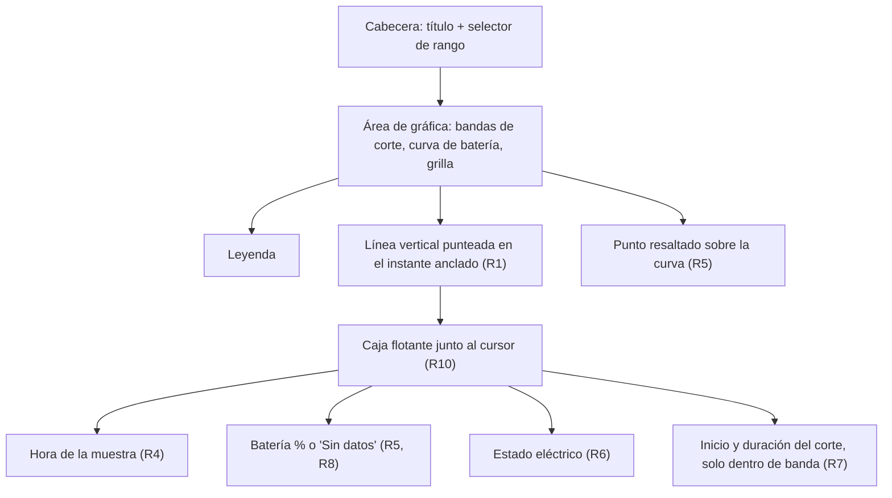
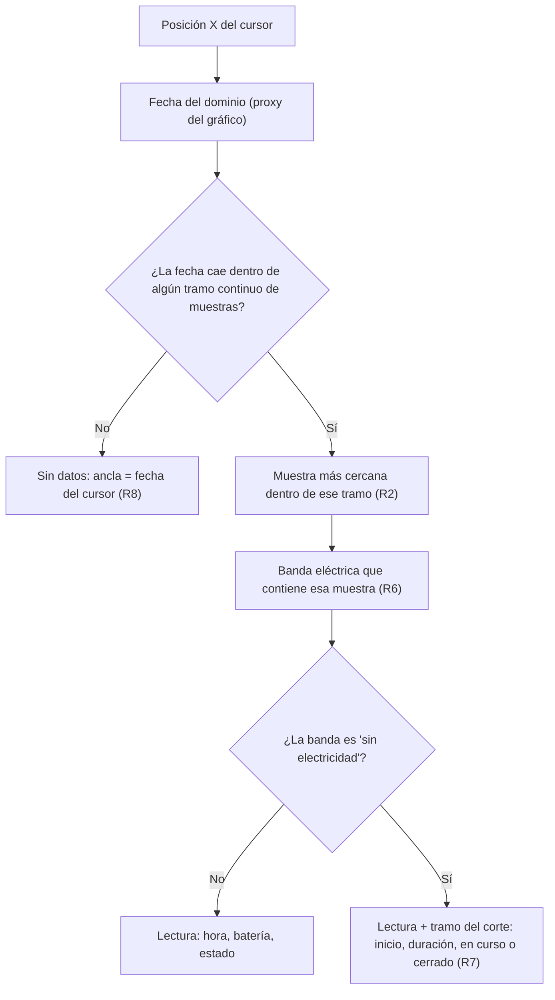

# Lector de energía al pasar el mouse - Plan

## Goal Capsule

- **Objetivo:** quien mira el historial puede leer con exactitud, en cualquier instante del rango, a qué hora ocurrió una lectura, en qué nivel estaba la batería, si había electricidad y cuánto llevaba un corte — sin estimarlo a ojo desde la grilla.
- **Means:** resolver el dato bajo el cursor con una función pura del framework y dibujar el crosshair como marcas del propio `Chart` (KTD1, KTD3).
- **Autoridad de producto:** este plan. La ventana de historial de energía es la única superficie afectada; el muestreo, el almacenamiento y el resto de la app no son alcance activo.
- **Autoridad técnica:** los requisitos R mandan sobre el comportamiento; los KTD mandan sobre el mecanismo dentro de esos requisitos.
- **Perfil de ejecución:** dominio primero con tests unitarios, luego el cableado de la vista, verificado con build y prueba manual.
- **Condición de parada:** si Swift Charts en macOS 14 no permite traducir la posición del cursor a una fecha del dominio, parar y reportar antes de sustituir la interacción por otra.
- **Bloqueos abiertos:** ninguno.

---

## Product Contract

### Summary

Al pasar el mouse sobre la gráfica del historial aparece una línea vertical punteada anclada a la muestra registrada más cercana, con el punto de intersección resaltado sobre la curva de batería.
Junto al cursor se muestra una caja flotante con la hora de esa muestra, el porcentaje de batería, el estado eléctrico y, dentro de un corte, cuándo empezó y cuánto duró.
En los tramos sin registro la hora sigue siendo real y el lector dice "Sin datos" en vez de mostrar un porcentaje que no existe.

### Problem Frame

La gráfica actual comunica bien la forma general — se ve que la batería subió, se mantuvo y luego cayó, y que hubo un corte — pero no permite leer un valor concreto. El eje Y tiene marcas cada 25 puntos y el eje X una etiqueta cada seis horas, así que cualquier lectura intermedia es una estimación visual.

Eso rompe justo en el momento en que la gráfica se consulta: después de un apagón, para reconstruir qué pasó. Preguntas como "a qué hora exacta se fue la luz", "en qué nivel estaba la batería cuando volvió" o "cuánto duró el corte" hoy se responden midiendo con el ojo contra la grilla, con un error de decenas de minutos y varios puntos porcentuales.

Las bandas rojas de fondo agravan el problema: marcan que hubo un corte, pero sus bordes caen entre etiquetas del eje, así que ni el inicio ni la duración son legibles.

### Key Decisions

- KD1. **La caja de datos flota junto al cursor.** Tener el dato completo donde está la vista pesa más que no tapar píxeles de la curva. (session-settled: user-directed — chosen over un lector fijo en la cabecera: leer arriba a la derecha obliga a que el ojo vaya y vuelva en cada movimiento). Governs R10.
- KD2. **El lector se ancla a una muestra registrada, nunca a un valor interpolado.** La exactitud que se pide solo significa algo si la hora y el porcentaje mostrados corresponden a una lectura que existió. (session-settled: user-approved — chosen over interpolar sobre la curva dibujada). Governs R2.
- KD3. **En los huecos manda la honestidad, no la continuidad.** El lector nunca completa lo que no se registró. (session-settled: user-directed — chosen over ocultar el lector en los huecos o pegarlo a la muestra lejana más cercana: ocultarlo impide leer dónde empieza y termina el hueco). Governs R8.
- KD4. **El comportamiento es idéntico en los tres rangos.** En 30 días cada píxel cubre varias muestras, pero la hora mostrada sigue siendo la de una lectura real y el detalle fino se obtiene cambiando a 24 h. (session-settled: user-approved — chosen over agregar por cubetas mín/máx/promedio en rangos anchos). Governs R9.

### Requirements

**Crosshair y anclaje**

- R1. Al mover el mouse dentro del área de la gráfica se muestra una línea vertical punteada, de trazo discreto, que marca el instante señalado a lo largo de todo el alto del área de trazado.
- R2. Fuera de los huecos definidos en R8, la línea, el punto y los datos se anclan a la muestra registrada más cercana en el tiempo a la posición del cursor, sin interpolar valores entre muestras.
- R3. Al salir el cursor del área de la gráfica desaparecen la línea, el punto resaltado y la caja.

**Contenido del lector**

- R4. La caja muestra la hora de la muestra anclada con precisión de minuto, incluyendo la fecha cuando el rango abarca más de un día.
- R5. La caja muestra el porcentaje de batería de la muestra anclada, y el punto de intersección entre la línea vertical y la curva queda resaltado.
- R6. La caja indica si en ese instante había o no electricidad.
- R7. Cuando la muestra anclada cae dentro de un tramo sin electricidad, la caja indica además a qué hora empezó ese tramo y cuánto ha durado, señalando si sigue en curso.

**Huecos y rangos**

- R8. Cuando el cursor cae en un tramo sin registro, la línea vertical y la hora siguen la posición real del cursor y la caja indica "Sin datos" en lugar de un porcentaje y un estado eléctrico.
- R9. El lector se comporta igual en los rangos 24 h, 7 días y 30 días.

**Presentación**

- R10. La caja acompaña al cursor y se reubica para permanecer siempre dentro de los límites visibles de la ventana.

Composición de la superficie afectada:

### Key Flows

- F1. Leer un instante cualquiera
  - **Trigger:** el usuario mueve el mouse sobre el área de la gráfica.
  - **Steps:** la posición horizontal se traduce a un instante; se elige la muestra registrada más cercana; se dibuja la línea vertical y el punto sobre esa muestra; la caja aparece junto al cursor con los datos de esa muestra.
  - **Outcome:** el usuario lee hora, batería y estado eléctrico de una lectura real.
  - **Covered by:** R1, R2, R4, R5, R6, R10
- F2. Reconstruir un corte
  - **Trigger:** el usuario recorre con el mouse una banda de "sin electricidad".
  - **Steps:** en cada posición el lector muestra los datos de la muestra anclada y añade el inicio del tramo sin electricidad y su duración acumulada.
  - **Outcome:** el usuario obtiene la hora de inicio, la duración y el nivel de batería en cualquier punto del corte sin medir contra la grilla.
  - **Covered by:** R2, R6, R7

### Acceptance Examples

- AE1. Lectura normal con electricidad
  - **Covers R2, R4, R5, R6.**
  - **Given** el rango 24 h y una muestra registrada a las 10:20 con 96 % y electricidad presente.
  - **When** el cursor se posa a 10:23 según la escala del eje.
  - **Then** la línea y el punto se anclan a la muestra de las 10:20 y la caja muestra esa hora, 96 % y "con electricidad".
- AE2. Dentro de un corte en curso
  - **Covers R7.**
  - **Given** un tramo sin electricidad que empezó a las 14:00 y sigue abierto.
  - **When** el cursor se posa sobre una muestra de las 17:20 dentro de ese tramo.
  - **Then** la caja indica el inicio a las 14:00 y una duración de 3 h 20 min señalada como en curso.
- AE3. Dentro de un corte ya terminado
  - **Covers R7.**
  - **Given** un tramo sin electricidad de 20:10 a 23:40.
  - **When** el cursor se posa sobre una muestra intermedia de ese tramo.
  - **Then** la caja indica el inicio a las 20:10 y la duración total de 3 h 30 min, sin señalarla como en curso.
- AE4. Hueco sin registro
  - **Covers R8.**
  - **Given** dos muestras separadas por más del umbral de hueco, con la curva cortada entre ellas.
  - **When** el cursor se posa en el medio de ese tramo.
  - **Then** la línea vertical y la hora corresponden a la posición real del cursor y la caja dice "Sin datos", sin porcentaje ni estado eléctrico.
- AE5. Cursor contra el borde
  - **Covers R10.**
  - **Given** el cursor cerca del borde derecho o superior del área de la gráfica.
  - **When** la caja aparece.
  - **Then** se reubica al lado opuesto del cursor de modo que queda completamente visible dentro de la ventana.

### Scope Boundaries

- Zoom, paneo o selección de un rango temporal arbitrario: el selector de 24 h / 7 días / 30 días sigue siendo la única forma de acotar.
- Agregación por cubetas (mín/máx/promedio) en los rangos anchos: diferido, per KD4.
- Cambios al intervalo de muestreo, al modelo `EnergySample` o al almacenamiento en `HistoryStore`.
- Navegación por teclado y lectura por VoiceOver del valor bajo el cursor: fuera de esta iteración.
- Historial de internet y ancho de banda: sigue fuera de alcance del historial, como en `docs/superpowers/specs/2026-08-18-energy-history-design.md`.

#### Deferred to Follow-Up Work

- Target de UI tests para cubrir el cableado del hover automáticamente. El proyecto no tiene ninguno hoy; crearlo es trabajo propio, no parte de esta funcionalidad.

### Dependencies / Assumptions

- `HistoryChart.build` ya devuelve `batterySegments` (partidos en los huecos), `powerBands` y el dominio `start`/`end`, de modo que todo lo que el lector necesita mostrar ya existe en el dominio; verificado en `AvangenioStatusKit/Domain/HistoryChart.swift`.
- Un "hueco" es la misma noción que ya usa el dominio: una separación mayor que `HistoryChart.defaultGapThreshold` (25 min) o una muestra sin `batteryPercent`.
- Las muestras llegan cada ~10 min mientras la app corre, así que la distancia máxima entre el cursor y la muestra anclada dentro de un tramo continuo es de unos pocos minutos.
- La ventana es de escritorio y se opera con mouse; no hay entrada táctil que atender.

### Sources / Research

- `AvangenioStatus/Views/HistoryView.swift` — la vista actual: `RectangleMark` para las bandas de corte y un `LineMark` por segmento con `interpolationMethod(.monotone)`.
- `AvangenioStatusKit/Domain/HistoryChart.swift` — construcción pura de los datos del gráfico y umbral de huecos.
- `AvangenioStatusKit/Models/EnergySample.swift` — la muestra: `timestamp`, `batteryPercent` opcional y `power`.
- `AvangenioStatusKit/Domain/MetricFormat.swift` — formato canónico del porcentaje, reutilizable por el lector.
- `AvangenioStatusTests/HistoryChartTests.swift` — patrón de tests puros del dominio a imitar.
- `project.yml` — target de despliegue macOS 14.0 y composición de los tres targets.
- `docs/superpowers/specs/2026-08-18-energy-history-design.md` — spec original del historial, que no contempla lectura interactiva.

---

## Planning Contract

**Product Contract preservation:** sin cambios. Requisitos, decisiones e IDs se conservan tal como los dejó el brainstorm.

### Key Technical Decisions

- KTD1. **La resolución del dato bajo el cursor vive como función pura en `AvangenioStatusKit`, no en la vista.** La vista solo aporta la posición del mouse; el resto es lógica testeable sin UI, igual que `HistoryChart`. Governs R2, R7, R8.
- KTD2. **"Estar en un hueco" se decide por pertenencia al tramo continuo de muestras, no por una tolerancia en píxeles.** La regla queda determinista y verificable en tests, y reutiliza el corte por huecos que el dominio ya hizo. (session-settled: user-approved — chosen over una tolerancia en píxeles medida en la vista: la tolerancia en píxeles cambiaría de significado con el ancho de la ventana y el rango). Governs R8.
- KTD3. **La línea vertical y el punto se dibujan como marcas del propio `Chart`** — una regla vertical con trazo discontinuo y un punto sobre la curva — en lugar de dibujarse en una capa aparte. Heredan escala, dominio y recorte del área de trazado sin recalcularlos. Governs R1, R5.
- KTD4. **La caja flotante se posiciona desde la superposición del gráfico usando la posición del cursor, con volteo contra los bordes.** Es el mecanismo que instancia KD1. Governs R10.
- KTD5. **La captura del hover se hace con una superficie transparente sobre el área de trazado que reporta el movimiento continuo del mouse, traduciendo la coordenada X a fecha del dominio con el proxy del gráfico.** Es la vía nativa de Swift Charts en macOS 14; los nombres exactos de la API se confirman al implementar. Governs R1, R3.

### High-Level Technical Design

La vista entrega una fecha; el dominio decide qué significa. Toda la ramificación vive en la función pura:

El resultado es un valor único que la vista consume para tres cosas: dónde poner la regla vertical, si dibujar el punto sobre la curva, y qué líneas rellenar en la caja.

### Assumptions

- Las capacidades que KTD3 y KTD5 necesitan de Swift Charts — traducir posición a valor del dominio, conocer el rectángulo del área de trazado y recibir el movimiento continuo del mouse — existen en macOS 14, el target de despliegue declarado en `project.yml`. No se pudo consultar documentación de Swift Charts en las fuentes disponibles, así que los nombres exactos se confirman contra el compilador durante U3.
- El repo no tiene target de UI tests, por lo que el cableado de la vista se verifica compilando y probando la app a mano; la cobertura automática se concentra en el dominio.
- `xcodegen` toma los fuentes por directorio, así que los archivos nuevos dentro de `AvangenioStatusKit/` y `AvangenioStatusTests/` no requieren tocar `project.yml`.

### Risks & Dependencies

- **La API de interacción de Swift Charts es la única pieza no verificada del plan.** Si el mapeo posición→fecha no está disponible como se asume, U3 se detiene y se reporta antes de sustituir el gesto por otro (ver la condición de parada del Goal Capsule). U1 y U2 no dependen de esto y se pueden completar igual.
- **El movimiento del mouse dispara la resolución muchas veces por segundo sobre series de hasta ~4.300 muestras en el rango de 30 días.** La búsqueda debe aprovechar que las muestras ya vienen ordenadas por tiempo en lugar de recorrerlas linealmente en cada evento.

### Sequencing

U1 → U2 → U3 → U4. U1 y U2 son independientes entre sí y pueden hacerse en cualquier orden; ambas deben existir antes de U4.

---

## Implementation Units

### U1. Resolución del dato bajo el cursor

- **Goal:** una función pura que, dada una fecha y los datos del gráfico, devuelve qué mostrar: una lectura anclada a muestra real, o "sin datos".
- **Requirements:** R2, R6, R7, R8; KTD1, KTD2. Cubre el comportamiento de AE1, AE2, AE3 y AE4 a nivel de dominio.
- **Dependencies:** ninguna.
- **Files:**
  - `AvangenioStatusKit/Domain/HistoryHover.swift` (nuevo)
  - `AvangenioStatusTests/HistoryHoverTests.swift` (nuevo)
- **Approach:**
  1. Definir los tipos de salida como structs y enums inmutables `Equatable, Sendable`, siguiendo el estilo de `BatteryPoint` y `PowerBand`: el resultado lleva la fecha de anclaje y, cuando hay lectura, la muestra, el estado eléctrico y el tramo de corte que la contiene.
  2. Ubicar la fecha del cursor entre los `batterySegments` de `HistoryChartData`: si cae dentro del intervalo cubierto por algún tramo, elegir el punto más cercano de ese tramo; si no, devolver "sin datos" con la fecha del cursor como ancla, per KTD2.
  3. Resolver el estado eléctrico buscando la `PowerBand` que contiene la muestra anclada, y componer el tramo de corte solo cuando esa banda está en "sin electricidad", marcándolo en curso cuando su fin coincide con el fin del dominio.
  4. Aprovechar el orden temporal de las muestras en la búsqueda en lugar de recorrer la serie completa en cada evento.
- **Execution note:** implementar el dominio con tests primero; es la única parte del cambio que se puede probar sin ejecutar la app.
- **Patterns to follow:** `AvangenioStatusKit/Domain/HistoryChart.swift` — `enum` sin estado con funciones estáticas puras, sin dependencias del reloj ni de SwiftUI.
- **Test scenarios:**
  - Covers AE1. Cursor entre dos muestras del mismo tramo: el resultado se ancla a la muestra más cercana en el tiempo, no a la anterior por defecto.
  - Cursor exactamente sobre una muestra: se ancla a esa muestra.
  - Covers AE4. Cursor entre dos tramos separados por un hueco: el resultado es "sin datos" y el ancla es la fecha del cursor, no la de ninguna muestra.
  - Cursor antes de la primera muestra o después de la última: "sin datos".
  - Covers AE2. Cursor sobre una muestra dentro de una banda sin electricidad que llega hasta el fin del dominio: el tramo de corte se marca en curso y su inicio es el de la banda.
  - Covers AE3. Cursor sobre una muestra dentro de una banda sin electricidad ya cerrada: el tramo lleva inicio y fin, sin marca de en curso.
  - Cursor sobre una muestra con electricidad: no se devuelve tramo de corte.
  - Datos vacíos (`batterySegments` y `powerBands` vacíos): "sin datos" para cualquier fecha, sin fallo.
  - Tramo de una sola muestra: cursor dentro del tramo devuelve esa muestra.
- **Verification:** los tests del dominio pasan y describen las cuatro ramas del diagrama de diseño (lectura, hueco, corte en curso, corte cerrado).

### U2. Formato de hora, duración y estado para el lector

- **Goal:** las cadenas que la caja muestra, con la fecha incluida solo cuando el rango lo requiere.
- **Requirements:** R4, R7, R9.
- **Dependencies:** ninguna.
- **Files:**
  - `AvangenioStatusKit/Domain/HistoryHoverFormat.swift` (nuevo)
  - `AvangenioStatusTests/HistoryHoverFormatTests.swift` (nuevo)
- **Approach:**
  1. Exponer una función de fecha que recibe el `HistoryRange` y devuelve hora con minutos para 24 h, y fecha corta más hora para 7 y 30 días.
  2. Exponer una función de duración que produce la forma compacta en horas y minutos usada en los ejemplos de aceptación.
  3. Reutilizar `MetricFormat.percent` para el porcentaje en vez de formatear el número otra vez.
  4. Fijar locale y zona horaria explícitamente al construir los formateadores, como hace `DateDisplay`, para que los tests no dependan del entorno.
- **Patterns to follow:** `AvangenioStatusKit/Domain/MetricFormat.swift` (funciones estáticas de formato) y `AvangenioStatusKit/Domain/DateDisplay.swift` (locale y zona explícitos).
- **Test scenarios:**
  - Rango 24 h: la salida lleva hora y minutos y no lleva fecha.
  - Rangos de 7 y 30 días: la salida lleva fecha corta además de la hora.
  - Duración de exactamente 3 h 20 min: se formatea con horas y minutos.
  - Duración menor a una hora: se formatea solo con minutos.
  - Duración de cero: no produce cadena vacía ni negativa.
  - El porcentaje sale del formato canónico existente, sin decimales.
- **Verification:** los tests de formato pasan con un locale fijo y las cadenas coinciden con las de los ejemplos de aceptación.

### U3. Captura del hover y crosshair en la gráfica

- **Goal:** la gráfica reacciona al mouse dibujando la línea vertical punteada y el punto de intersección.
- **Requirements:** R1, R2, R3, R5, R9; KTD3, KTD5.
- **Dependencies:** U1.
- **Files:**
  - `AvangenioStatus/Views/HistoryView.swift` (modificar)
- **Approach:**
  1. Añadir a la vista un estado privado con el resultado del hover actual, nulo cuando el cursor está fuera.
  2. Superponer al `Chart` una superficie transparente que capte el movimiento continuo del mouse, traducir la coordenada X a fecha con el proxy del gráfico y pedirle a U1 la resolución.
  3. Dibujar la regla vertical con trazo discontinuo en la fecha de anclaje del resultado, y el punto sobre la curva solo cuando hay lectura, per KTD3.
  4. Limpiar el estado cuando el cursor sale del área o cae fuera del dominio, per R3.
  5. Confirmar contra el compilador los nombres exactos de las APIs de Swift Charts asumidos en KTD5 antes de dar la unidad por cerrada.
- **Execution note:** aquí no hay cobertura automática; la prueba es compilar y recorrer la gráfica con el mouse en los tres rangos.
- **Patterns to follow:** la composición existente del `Chart` en `AvangenioStatus/Views/HistoryView.swift`, que ya separa bandas y segmentos y fija el dominio con `chartXScale` y `chartYScale`.
- **Test scenarios:** el proyecto no tiene target de UI tests, así que estos escenarios se ejecutan a mano sobre la app corriendo y son parte del cierre de la unidad.
  - Mover el mouse por una zona con datos continuos: la línea vertical salta entre muestras y no se queda pegada al cursor entre ellas.
  - Covers AE4. Mover el mouse por un hueco de la curva: la línea sigue al cursor de forma continua y no aparece punto sobre la curva.
  - Sacar el cursor por cada uno de los cuatro bordes del área: la línea y el punto desaparecen en todos los casos.
  - Repetir el recorrido en los rangos 24 h, 7 días y 30 días: el comportamiento no cambia, per R9.
  - Cambiar de rango con el cursor quieto dentro de la gráfica: no queda un crosshair obsoleto de la vista anterior.
- **Verification:** al recorrer la gráfica aparece una línea vertical punteada que sigue al mouse; sobre datos continuos se ancla a las muestras y resalta el punto; en los huecos sigue la posición del cursor sin punto; al salir del área desaparece todo.

### U4. Caja flotante del lector

- **Goal:** la caja que muestra hora, batería, estado eléctrico y datos del corte, pegada al cursor y siempre visible.
- **Requirements:** R4, R5, R6, R7, R8, R10; KTD4.
- **Dependencies:** U1, U2, U3.
- **Files:**
  - `AvangenioStatus/Views/HoverReadoutBox.swift` (nuevo)
  - `AvangenioStatus/Views/HistoryView.swift` (modificar)
- **Approach:**
  1. Extraer la caja a su propia vista, que recibe el resultado del hover y el rango, y compone sus líneas con las funciones de U2.
  2. Renderizar la variante "Sin datos" cuando el resultado no tiene lectura: solo la hora del cursor, sin porcentaje ni estado, per R8.
  3. Añadir las líneas del corte únicamente cuando el resultado trae tramo, per R7.
  4. Posicionar la caja respecto del cursor dentro de la superposición del gráfico y voltearla hacia el lado opuesto cuando no cabe contra el borde derecho o superior, per KTD4.
- **Patterns to follow:** el estilo de las vistas pequeñas existentes en `AvangenioStatus/Views/`, con `.font(.caption)` y `.foregroundStyle(.secondary)` como en la leyenda actual.
- **Test scenarios:** sin target de UI tests, estos escenarios se ejecutan a mano sobre la app corriendo y son parte del cierre de la unidad.
  - Covers AE1. Posar el cursor sobre un tramo con electricidad: la caja muestra hora, porcentaje y "con electricidad", y ninguna línea de corte.
  - Covers AE2. Posar el cursor dentro de un corte abierto: la caja añade la hora de inicio y la duración marcada como en curso.
  - Covers AE3. Posar el cursor dentro de un corte ya cerrado: la caja muestra inicio y duración total, sin marca de en curso.
  - Covers AE4. Posar el cursor en un hueco: la caja muestra solo la hora del cursor y "Sin datos", sin porcentaje ni estado.
  - Covers AE5. Llevar el cursor contra el borde derecho y contra el borde superior: la caja se voltea y queda completa dentro de la ventana en ambos casos.
  - Recorrer la gráfica en el rango de 30 días moviendo el mouse rápido: el contenido de la caja se actualiza sin trabar la interfaz.
- **Verification:** los cinco ejemplos de aceptación se reproducen en la app: lectura normal, corte en curso, corte cerrado, hueco y cursor contra el borde.

---

## Verification Contract

| Comprobación | Comando | Alcance |
|---|---|---|
| Tests unitarios | `make test` | Todo el framework, incluidos `HistoryHoverTests` y `HistoryHoverFormatTests`. Debe quedar en 0 fallos. |
| Compilación de la app | `make build` | Confirma que el cableado de U3 y U4 compila contra Swift Charts en macOS 14. |
| Prueba manual del lector | Ejecutar la app y abrir Historial de energía | Recorrer la gráfica con el mouse en los rangos 24 h, 7 días y 30 días y reproducir AE1 a AE5. |

La prueba manual es obligatoria para U3 y U4: no hay target de UI tests en el proyecto y esas unidades no tienen cobertura automática.

---

## Definition of Done

Global:

- Los diez requisitos del Product Contract se cumplen en la app en ejecución.
- `make test` pasa sin fallos y `make build` compila sin advertencias nuevas.
- Los cinco ejemplos de aceptación se verificaron a mano en los tres rangos.
- No queda código de intentos descartados: superposiciones, estados o formateadores que dejaron de usarse se eliminan antes de dar el trabajo por terminado.
- El dominio nuevo no importa SwiftUI ni Charts, y la vista no contiene lógica de resolución del hover.

Por unidad:

- U1: los tests del dominio cubren lectura, hueco, corte en curso y corte cerrado, y pasan.
- U2: los tests de formato pasan con locale fijo y las cadenas coinciden con las de los ejemplos de aceptación.
- U3: la línea vertical y el punto responden al mouse en los tres rangos y desaparecen al salir del área.
- U4: la caja muestra el contenido correcto en cada estado y permanece visible contra los bordes.
